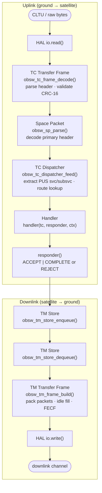
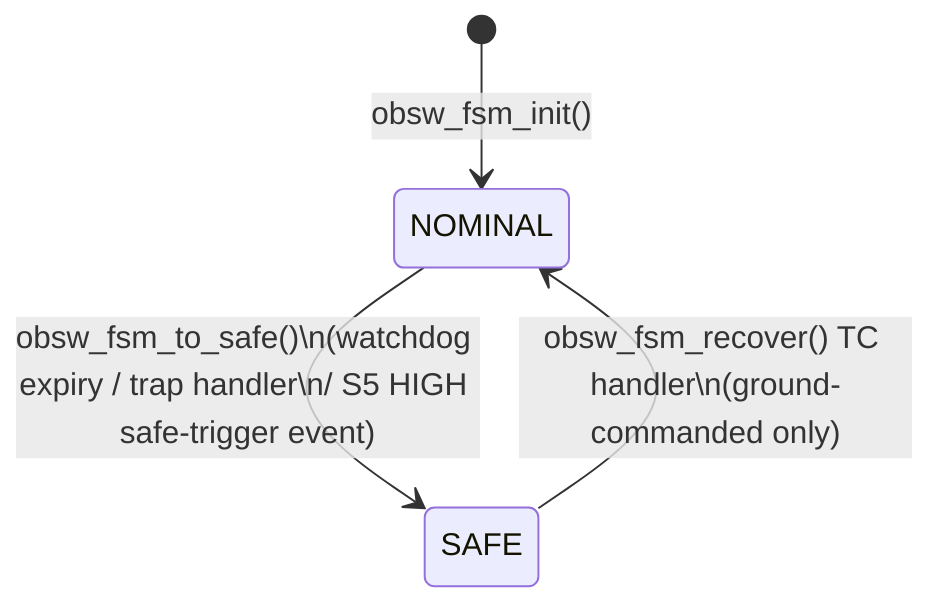
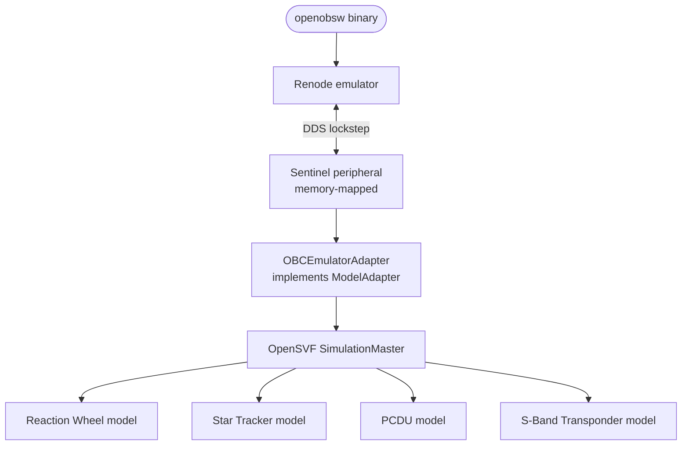

# openobsw — Architecture

## Overview

openobsw is a C11 TT&C middleware stack for satellite on-board software.
It implements the uplink (TC) and downlink (TM) data paths defined by the
CCSDS and ECSS PUS-C standards, from raw frame bytes down to application
command handlers — with no dynamic allocation, no global state, and a clean
HAL boundary between the protocol stack and platform I/O.

It is designed to be the reference OBSW target for
[OpenSVF](https://github.com/lipofefeyt/opensvf), enabling closed-loop
system validation against equipment models.

---

## Design principles

**Zero dynamic allocation.** All state is caller-owned. No `malloc`, no heap
use anywhere inside the library. Routing tables, ring buffers and dispatcher
contexts are statically allocated by the application and passed in at init.

**No global state.** Every function takes an explicit context pointer.
Multiple dispatcher instances can coexist safely; there is no shared mutable
state between them.

**Portable C11.** No compiler extensions, no POSIX dependencies in the core
library. Compiles cleanly under `-Wall -Wextra -Wpedantic` with zero warnings.

**HAL-isolated.** The core stack never calls platform I/O directly.
All I/O goes through `obsw_io_ops_t`, a vtable of function pointers.
Platform ports implement this once; the rest of the stack is untouched.

**Validation-first.** Every module ships with a unit test suite.
An integration test exercises the full uplink/downlink path end-to-end.

---

## Layer model

```
 ┌─────────────────────────────────────────────────────────┐
 │                   FDIR                                   │
 │    FSM (safe mode) · Watchdog · Trap handlers            │
 └────────────────────────┬────────────────────────────────┘
                          │  mode transitions / safe triggers
 ┌────────────────────────▼────────────────────────────────┐
 │              PUS-C Services                              │
 │    S1 · S3 · S5 · S6 (memory) · S8 (functions) · S17   │
 └────────────────────────┬────────────────────────────────┘
                          │  obsw_tc_t (parsed command)
 ┌────────────────────────▼────────────────────────────────┐
 │              TC Dispatcher  (tc/dispatcher.h)            │
 │   static routing table: APID / service / subservice      │
 │   → obsw_fsm_tc_allowed() check in SAFE mode             │
 └────────────────────────┬────────────────────────────────┘
                          │  raw space packet bytes
 ┌────────────────────────▼────────────────────────────────┐
 │           Space Packet layer  (ccsds/space_packet.h)     │
 │   primary header encode / decode / parse                 │
 └────────────────────────┬────────────────────────────────┘
                          │  TC frame data field
 ┌────────────────────────▼────────────────────────────────┐
 │           TC Frame layer  (ccsds/tc_frame.h)             │
 │   primary header decode, CRC-16/CCITT validation         │
 └────────────────────────┬────────────────────────────────┘
                          │  raw bytes from uplink channel
 ┌────────────────────────▼────────────────────────────────┐
 │               HAL I/O  (hal/io.h)                        │
 │   obsw_io_ops_t vtable: read() / write() / ctx           │
 └─────────────────────────────────────────────────────────┘
```

The downlink path mirrors this in reverse:

```
 Application / PUS handler
         │  enqueue TM packet
         ▼
 TM Store  (tm/store.h)
         │  dequeue TM packet
         ▼
 TM Frame builder  (ccsds/tm_frame.h)
         │  raw frame bytes
         ▼
 HAL I/O write()
```

---

## Module reference

### `ccsds/space_packet` — CCSDS 133.0-B

The fundamental unit of the CCSDS stack. Every TC command and TM telemetry
packet is a space packet.

Key types: `obsw_sp_primary_hdr_t`, `obsw_sp_packet_t`

Key functions:
- `obsw_sp_encode_primary()` — serialise primary header to 6 bytes
- `obsw_sp_decode_primary()` — deserialise 6 bytes into header struct
- `obsw_sp_parse()` — decode header + set payload pointer (zero-copy)

---

### `ccsds/tc_frame` — CCSDS 232.0-B

Decodes TC Transfer Frames received from the uplink channel.
Validates the CRC-16/CCITT FECF before exposing the data field.

Key types: `obsw_tc_frame_header_t`, `obsw_tc_frame_t`

Key functions:
- `obsw_tc_frame_decode()` — parse header, validate CRC, set data pointer
- `obsw_crc16_ccitt()` — poly 0x1021, init 0xFFFF; also used by TM frame

Primary header fields decoded:

| Field | Bits | Notes |
|---|---|---|
| version | 2 | Always 0b00 |
| bypass_flag | 1 | Type-A/B service |
| ctrl_cmd_flag | 1 | Control command |
| spacecraft_id | 10 | SCID — 10-bit value, unique per spacecraft, assigned by mission authority. Must match across TC frame decoder and TM frame builder. Mission-dependent — see [docs/mission-config.md](mission-config.md). |
| virtual_channel_id | 6 | VCID |
| frame_len | 10 | Total frame octets - 1 |
| frame_seq_num | 8 | Wraps at 255 |

---

### `ccsds/tm_frame` — CCSDS 132.0-B

Builds TM Transfer Frames for downlink. Packs TM space packets into the
data field zone; fills unused space with idle packets per CCSDS 133.0-B §4.3.
Optionally appends CRC-16/CCITT FECF.

Key types: `obsw_tm_frame_config_t`

Key functions:
- `obsw_tm_frame_build()` — encode header, embed payload, fill idle, append CRC

Configuration is per virtual channel and typically constant for a mission:

```c
obsw_tm_frame_config_t cfg = {
    .spacecraft_id               = 0x001,
    .virtual_channel_id          = 0,
    .master_channel_frame_count  = 0,   /* incremented by caller each frame */
    .virtual_channel_frame_count = 0,
    .enable_fecf                 = 1,
    .frame_data_field_len        = 64,  /* mission-specific */
};
```

---

### `pus/s6` — PUS-C S6 Memory Management

Provides ground-commanded memory load, check and dump. All operations
work on raw memory addresses encoded as 4-byte BE fields (PUS-C standard,
correct for 32-bit targets).

Key handlers: `obsw_s6_load()`, `obsw_s6_check()`, `obsw_s6_dump()`

| Subservice | TC | TM response |
|---|---|---|
| 2 | Load memory area | TM(1,1) + TM(1,7) |
| 5 | Check memory area (CRC-16/CCITT) | TM(6,10) match / TM(6,11) mismatch |
| 9 | Dump memory area | TM(6,6) data packet |

Reuses `obsw_crc16_ccitt()` from the TC frame layer — single CRC
implementation across the whole stack.

---

### `pus/s8` — PUS-C S8 Function Management

Executes named on-board functions by ID from a static caller-owned table.
Replaces the earlier mission-defined `TC(128,1)` recovery command with a
standards-compliant interface.

Key handler: `obsw_s8_perform()`

| Function ID | Name | Effect |
|---|---|---|
| 1 | `OBSW_S8_FN_RECOVER_NOMINAL` | Calls `obsw_fsm_to_nominal()` |

Additional function IDs are registered by the application in `obsw_s8_entry_t[]`.

---

### `tc/dispatcher` — ECSS PUS-C

Routes incoming TC space packets to registered handlers via a static lookup
table. First match wins. APID `0xFFFF` is a wildcard that matches any APID.

```c
static obsw_tc_route_t routes[] = {
    { .apid = 0xFFFF, .service = 17, .subservice = 1,
      .handler = handle_s17_ping, .ctx = NULL },
    { .apid = 0x010,  .service =  3, .subservice = 5,
      .handler = handle_s3_enable_hk, .ctx = &hk_ctx },
};

obsw_tc_dispatcher_init(&dispatcher, routes,
                         sizeof(routes)/sizeof(routes[0]),
                         my_responder, NULL);
```

Handlers receive a parsed `obsw_tc_t` and a `responder` callback:

```c
int handle_s17_ping(const obsw_tc_t *tc,
                     obsw_tc_responder_t respond,
                     void *ctx)
{
    respond(OBSW_TC_ACK_ACCEPT | OBSW_TC_ACK_COMPLETE, tc, ctx);
    return 0;
}
```

If no route matches, the responder is called with `OBSW_TC_ACK_REJECT`.

---

### `tm/store` — TM ring buffer

Fixed-size power-of-two ring buffer for outgoing TM packets.
Telemetry sources enqueue; the TM frame builder dequeues.
Size configured at compile time via `OBSW_TM_STORE_SLOTS` (default 32)
and `OBSW_TM_MAX_PACKET_LEN` (default 1024 bytes).

---

### `hal/io` — Platform I/O vtable

```c
typedef struct {
    int (*write)(const uint8_t *buf, size_t len, void *ctx);
    int (*read) (uint8_t *buf, size_t len, void *ctx);
    void *ctx;
} obsw_io_ops_t;
```

| Platform | Implementation |
|---|---|
| Host sim (current) | stdin / stdout |
| Renode (v0.5) | Memory-mapped sentinel peripheral |
| Bare metal | UART / SpaceWire driver |

---

## Full data flow



---

## FDIR

### Safe mode FSM — `fdir/fsm.h`

Two-state mode machine. All state is caller-owned; no globals.



**Entry/exit hooks** are mission-defined function pointers registered in
`obsw_fsm_config_t`. On entry to SAFE: disable payload, switch to safe beacon.
On exit: re-enable nominal operations. Neither hook is mandatory.

**TC whitelist** controls which commands are accepted in SAFE mode. All
others are rejected with `TM(1,2)`. The dispatcher calls
`obsw_fsm_tc_allowed()` before routing. A typical safe-mode whitelist:

```c
static const obsw_fsm_tc_entry_t safe_whitelist[] = {
    { .service = 17, .subservice = 1 },  /* S17 ping      */
    { .service =  1, .subservice = 1 },  /* S1 acceptance */
    { .service = 128, .subservice = 1 }, /* mission: recover command */
};
```

**Recovery** is ground-commanded only. `obsw_fsm_recover()` is a TC handler
the application registers at a mission-defined APID/svc/subsvc. It emits
`TM(1,1)` and `TM(1,7)` via S1 and transitions the FSM back to NOMINAL.

---

### Watchdog — `fdir/watchdog.h`

Software countdown watchdog. Zero dependencies on OS timers.

```
Control cycle:
  obsw_wd_kick(&wd)    ← called by monitored task
  obsw_wd_tick(&wd)    ← called once per cycle after all kicks

  If kicked:  countdown reloaded to timeout_ticks
  If not:     countdown decrements
  At zero:    expire_cb() fired once (latched — no repeat)
```

Typical wiring to the FSM:

```c
static void on_wd_expiry(void *ctx)
{
    obsw_s5_report(&s5, OBSW_S5_HIGH, EVENT_WD_EXPIRY, NULL, 0);
    obsw_fsm_to_safe((obsw_fsm_ctx_t *)ctx);
}

obsw_wd_init(&wd, 10, on_wd_expiry, &fsm);
```

---

### S5 safe-trigger coupling

`obsw_s5_ctx_t` carries an optional FSM pointer and a static list of
`safe_trigger_ids`. If an `OBSW_S5_HIGH` report is emitted with a matching
event ID, `obsw_fsm_to_safe()` is called automatically:

```c
s5.fsm                 = (struct obsw_fsm_ctx *)&fsm;
s5.safe_trigger_ids[0] = EVENT_POWER_FAULT;
s5.safe_trigger_ids[1] = EVENT_COMMS_LOSS;
s5.safe_trigger_count  = 2;
```

If `fsm` is NULL, S5 behaves exactly as in v0.3 — no breaking change.

---

### FDIR event flow

```mermaid
flowchart TD
    WD[Watchdog expiry\nobsw_wd_tick()]
    TRAP[Trap handler\ndata abort / prefetch / stack overflow]
    S5[S5 HIGH event\nmatching safe_trigger_id]

    WD   --> SAFE[obsw_fsm_to_safe()]
    TRAP --> SAFE
    S5   --> SAFE

    SAFE --> HOOK[on_enter_safe hook\ndisable payload\nswitch beacon]
    SAFE --> TM[TM store\nS5 event report enqueued]

    RECOVER[Ground TC\nobsw_fsm_recover()] --> NOM[NOMINAL\non_exit_safe hook]
```

---

### Trap table stubs

Platform-specific fault handlers live in `src/hal/arm/` and
`src/hal/msp430/`. They are declared `__attribute__((weak))` — the
application overrides them with strong definitions.

Each handler must:
1. Emit an `OBSW_S5_HIGH` event (if S5 context is available).
2. Call `obsw_fsm_to_safe()`.
3. Halt (`while(1)`) or trigger a hardware reset — mission policy.

| Platform | File | Vectors covered |
|---|---|---|
| ARM Cortex-A (ZynqMP) | `src/hal/arm/trap_table.c` | Undefined instruction, data abort, prefetch abort, stack overflow |
| MSP430 | `src/hal/msp430/trap_table.c` | WDT expiry, vacant vector, system NMI |

---

## OpenSVF integration (v0.5)

openobsw is the reference OBSW target for
[OpenSVF](https://github.com/lipofefeyt/opensvf).
The integration path:



The three deferred OpenSVF requirements that gate this integration are:
- `SVF-DEV-029` — CCSDS adapter
- `SVF-DEV-034` — ParameterStoreDdsBridge
- `SVF-DEV-037` — PUS command adapter

---

## Standards references

| Standard | Title |
|---|---|
| CCSDS 133.0-B | Space Packet Protocol |
| CCSDS 232.0-B | TC Space Data Link Protocol |
| CCSDS 132.0-B | TM Space Data Link Protocol |
| CCSDS 131.0-B | TM Synchronization and Channel Coding |
| ECSS-E-ST-70-41C | Packet Utilisation Standard (PUS-C) |