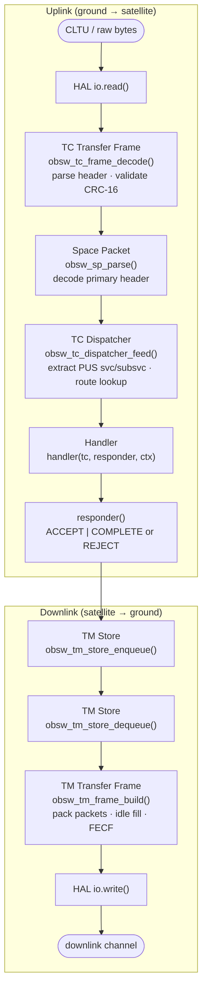
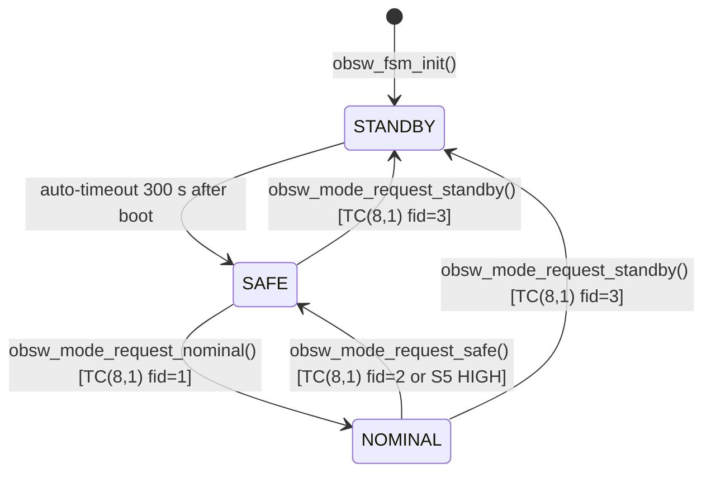
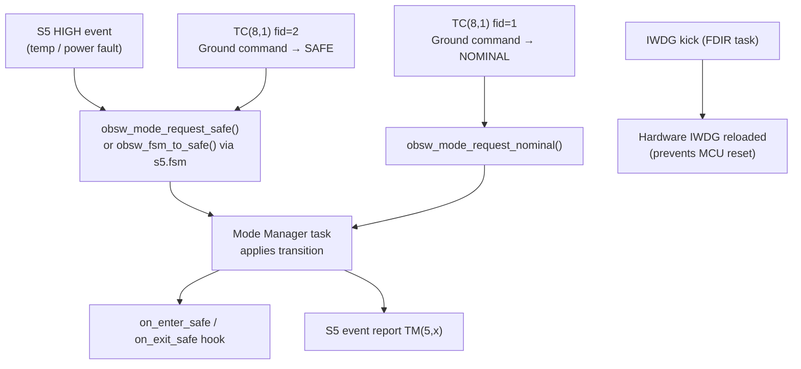
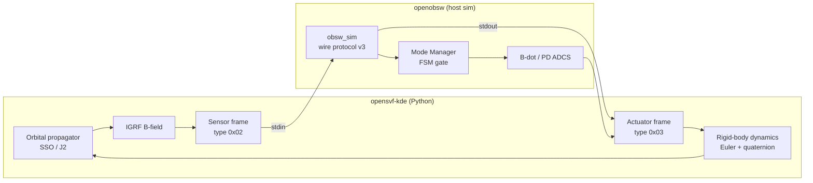

# openobsw — Architecture

## Overview

openobsw is a C11 TT&C middleware stack for satellite on-board software.
It implements the uplink (TC) and downlink (TM) data paths defined by the
CCSDS and ECSS PUS-C standards, from raw frame bytes down to application
command handlers — with no dynamic allocation, no global state, and a clean
HAL boundary between the protocol stack and platform I/O.

It is designed to be the reference OBSW target for
[OpenSVF](https://github.com/lipofefeyt/opensvf), enabling closed-loop
system validation against equipment models.

---

## Design principles

**Zero dynamic allocation.** All state is caller-owned. No `malloc`, no heap
use anywhere inside the library. Routing tables, ring buffers and dispatcher
contexts are statically allocated by the application and passed in at init.

**No global state.** Every function takes an explicit context pointer.
Multiple dispatcher instances can coexist safely; there is no shared mutable
state between them.

**Portable C11.** No compiler extensions, no POSIX dependencies in the core
library. Compiles cleanly under `-Wall -Wextra -Wpedantic` with zero warnings.

**HAL-isolated.** The core stack never calls platform I/O directly.
All I/O goes through `obsw_io_ops_t`, a vtable of function pointers.
Platform ports implement this once; the rest of the stack is untouched.

**Validation-first.** Every module ships with a unit test suite.
An integration test exercises the full uplink/downlink path end-to-end.

---

## Layer model

```
 ┌─────────────────────────────────────────────────────────┐
 │               Mode Manager  (task/mode.h)                │
 │    FSM owner: STANDBY → SAFE → NOMINAL transitions       │
 │    300 s auto-timeout STANDBY→SAFE on boot               │
 └────────────────────────┬────────────────────────────────┘
                          │  mode transitions
 ┌────────────────────────▼────────────────────────────────┐
 │                   FDIR  (task/fdir.h)                    │
 │    Fault responder: IWDG kick · S5 HIGH → to_safe()     │
 │    LCD status bar                                        │
 └────────────────────────┬────────────────────────────────┘
                          │  fault triggers / safe requests
 ┌────────────────────────▼────────────────────────────────┐
 │              PUS-C Services                              │
 │    S1 · S3 · S5 · S6 (memory) · S8 (functions) · S17   │
 └────────────────────────┬────────────────────────────────┘
                          │  obsw_tc_t (parsed command)
 ┌────────────────────────▼────────────────────────────────┐
 │              TC Dispatcher  (tc/dispatcher.h)            │
 │   static routing table: APID / service / subservice      │
 │   → obsw_fsm_tc_allowed() check in SAFE mode             │
 └────────────────────────┬────────────────────────────────┘
                          │  raw space packet bytes
 ┌────────────────────────▼────────────────────────────────┐
 │           Space Packet layer  (ccsds/space_packet.h)     │
 │   primary header encode / decode / parse                 │
 └────────────────────────┬────────────────────────────────┘
                          │  TC frame data field
 ┌────────────────────────▼────────────────────────────────┐
 │           TC Frame layer  (ccsds/tc_frame.h)             │
 │   primary header decode, CRC-16/CCITT validation         │
 └────────────────────────┬────────────────────────────────┘
                          │  raw bytes from uplink channel
 ┌────────────────────────▼────────────────────────────────┐
 │               HAL I/O  (hal/io.h)                        │
 │   obsw_io_ops_t vtable: read() / write() / ctx           │
 └─────────────────────────────────────────────────────────┘
```

The downlink path mirrors this in reverse:

```
 Application / PUS handler
         │  enqueue TM packet
         ▼
 TM Store  (tm/store.h)
         │  dequeue TM packet
         ▼
 TM Frame builder  (ccsds/tm_frame.h)
         │  raw frame bytes
         ▼
 HAL I/O write()
```

---

## Module reference

### `ccsds/space_packet` — CCSDS 133.0-B

The fundamental unit of the CCSDS stack. Every TC command and TM telemetry
packet is a space packet.

Key types: `obsw_sp_primary_hdr_t`, `obsw_sp_packet_t`

Key functions:
- `obsw_sp_encode_primary()` — serialise primary header to 6 bytes
- `obsw_sp_decode_primary()` — deserialise 6 bytes into header struct
- `obsw_sp_parse()` — decode header + set payload pointer (zero-copy)

---

### `ccsds/tc_frame` — CCSDS 232.0-B

Decodes TC Transfer Frames received from the uplink channel.
Validates the CRC-16/CCITT FECF before exposing the data field.

Key types: `obsw_tc_frame_header_t`, `obsw_tc_frame_t`

Key functions:
- `obsw_tc_frame_decode()` — parse header, validate CRC, set data pointer
- `obsw_crc16_ccitt()` — poly 0x1021, init 0xFFFF; also used by TM frame

Primary header fields decoded:

| Field | Bits | Notes |
|---|---|---|
| version | 2 | Always 0b00 |
| bypass_flag | 1 | Type-A/B service |
| ctrl_cmd_flag | 1 | Control command |
| spacecraft_id | 10 | SCID — 10-bit value, unique per spacecraft, assigned by mission authority. Must match across TC frame decoder and TM frame builder. Mission-dependent — see [docs/mission-config.md](mission-config.md). |
| virtual_channel_id | 6 | VCID |
| frame_len | 10 | Total frame octets - 1 |
| frame_seq_num | 8 | Wraps at 255 |

---

### `ccsds/tm_frame` — CCSDS 132.0-B

Builds TM Transfer Frames for downlink. Packs TM space packets into the
data field zone; fills unused space with idle packets per CCSDS 133.0-B §4.3.
Optionally appends CRC-16/CCITT FECF.

Key types: `obsw_tm_frame_config_t`

Key functions:
- `obsw_tm_frame_build()` — encode header, embed payload, fill idle, append CRC

Configuration is per virtual channel and typically constant for a mission:

```c
obsw_tm_frame_config_t cfg = {
    .spacecraft_id               = 0x001,
    .virtual_channel_id          = 0,
    .master_channel_frame_count  = 0,   /* incremented by caller each frame */
    .virtual_channel_frame_count = 0,
    .enable_fecf                 = 1,
    .frame_data_field_len        = 64,  /* mission-specific */
};
```

---

### `pus/s6` — PUS-C S6 Memory Management

Provides ground-commanded memory load, check and dump. All operations
work on raw memory addresses encoded as 4-byte BE fields (PUS-C standard,
correct for 32-bit targets).

Key handlers: `obsw_s6_load()`, `obsw_s6_check()`, `obsw_s6_dump()`

| Subservice | TC | TM response |
|---|---|---|
| 2 | Load memory area | TM(1,1) + TM(1,7) |
| 5 | Check memory area (CRC-16/CCITT) | TM(6,10) match / TM(6,11) mismatch |
| 9 | Dump memory area | TM(6,6) data packet |

Reuses `obsw_crc16_ccitt()` from the TC frame layer — single CRC
implementation across the whole stack.

---

### `pus/s8` — PUS-C S8 Function Management

Executes named on-board functions by ID from a static caller-owned table.
Replaces the earlier mission-defined `TC(128,1)` recovery command with a
standards-compliant interface.

Key handler: `obsw_s8_perform()`

| Function ID | Constant | Effect |
|---|---|---|
| 1 | `OBSW_S8_FN_RECOVER_NOMINAL` | Request SAFE → NOMINAL via Mode Manager |
| 2 | `OBSW_S8_FN_REQUEST_SAFE`    | Request any → SAFE via Mode Manager |
| 3 | `OBSW_S8_FN_REQUEST_STANDBY` | Request any → STANDBY via Mode Manager |

Handlers call `obsw_mode_request_*()` — they do not touch the FSM directly,
keeping the FSM ownership in the Mode Manager task.

Additional function IDs are registered by the application in `obsw_s8_entry_t[]`.

---

### `tc/dispatcher` — ECSS PUS-C

Routes incoming TC space packets to registered handlers via a static lookup
table. First match wins. APID `0xFFFF` is a wildcard that matches any APID.

```c
static obsw_tc_route_t routes[] = {
    { .apid = 0xFFFF, .service = 17, .subservice = 1,
      .handler = handle_s17_ping, .ctx = NULL },
    { .apid = 0x010,  .service =  3, .subservice = 5,
      .handler = handle_s3_enable_hk, .ctx = &hk_ctx },
};

obsw_tc_dispatcher_init(&dispatcher, routes,
                         sizeof(routes)/sizeof(routes[0]),
                         my_responder, NULL);
```

Handlers receive a parsed `obsw_tc_t` and a `responder` callback:

```c
int handle_s17_ping(const obsw_tc_t *tc,
                     obsw_tc_responder_t respond,
                     void *ctx)
{
    respond(OBSW_TC_ACK_ACCEPT | OBSW_TC_ACK_COMPLETE, tc, ctx);
    return 0;
}
```

If no route matches, the responder is called with `OBSW_TC_ACK_REJECT`.

---

### `tm/store` — TM ring buffer

Fixed-size power-of-two ring buffer for outgoing TM packets.
Telemetry sources enqueue; the TM frame builder dequeues.
Size configured at compile time via `OBSW_TM_STORE_SLOTS` (default 32)
and `OBSW_TM_MAX_PACKET_LEN` (default 1024 bytes).

---

### `hal/io` — Platform I/O vtable

```c
typedef struct {
    int (*write)(const uint8_t *buf, size_t len, void *ctx);
    int (*read) (uint8_t *buf, size_t len, void *ctx);
    void *ctx;
} obsw_io_ops_t;
```

| Platform | Implementation |
|---|---|
| Host sim (current) | stdin / stdout |
| Renode (v0.5) | Memory-mapped sentinel peripheral |
| Bare metal | UART / SpaceWire driver |

---

## Full data flow


```mermaid
flowchart TD
    subgraph UPLINK ["Uplink  (ground → satellite)"]
        A([CLTU / raw bytes]) --> B["HAL io.read()"]
        B --> C["TC Transfer Frame\nobsw_tc_frame_decode()\nparse header · validate CRC-16"]
        C --> D["Space Packet\nobsw_sp_parse()\ndecode primary header"]
        D --> E["TC Dispatcher\nobsw_tc_dispatcher_feed()\nextract PUS svc/subsvc · route lookup"]
        E --> F["Handler\nhandler(tc, responder, ctx)"]
        F --> G["responder()\nACCEPT | COMPLETE or REJECT"]
    end

    subgraph DOWNLINK ["Downlink  (satellite → ground)"]
        G --> H["TM Store\nobsw_tm_store_enqueue()"]
        H --> I["TM Store\nobsw_tm_store_dequeue()"]
        I --> J["TM Transfer Frame\nobsw_tm_frame_build()\npack packets · idle fill · FECF"]
        J --> K["HAL io.write()"]
        K --> L([downlink channel])
    end
```

---

## Mode Manager and FDIR

### Three-state FSM — `fdir/fsm.h` + `task/mode.h`

The mode FSM has three states. All state is caller-owned; no globals.
The Mode Manager task (`task/mode.h`) is the sole owner of the FSM instance.


```mermaid
stateDiagram-v2
    [*] --> STANDBY : obsw_fsm_init()
    STANDBY --> SAFE : auto-timeout 300 s after boot
    SAFE --> NOMINAL : obsw_mode_request_nominal() [TC(8,1) fid=1]
    NOMINAL --> SAFE : obsw_mode_request_safe() [TC(8,1) fid=2 or S5 HIGH]
    SAFE --> STANDBY : obsw_mode_request_standby() [TC(8,1) fid=3]
    NOMINAL --> STANDBY : obsw_mode_request_standby() [TC(8,1) fid=3]
```

**STANDBY** is the boot state. AOCS is off; TCs are accepted but AOCS
algorithms do not run. After 300 s the Mode Manager automatically transitions
to SAFE.

**SAFE** is the fault-containment mode. Only B-dot AOCS runs (magnetometer +
magnetorquers). A subset of TCs is accepted per the dispatcher TC whitelist.

**NOMINAL** is the full-operations mode. PD quaternion AOCS runs with reaction
wheels and star tracker.

**Entry/exit hooks** are mission-defined function pointers registered in
`obsw_fsm_config_t`. On entry to SAFE: switch to safe beacon. On exit to
NOMINAL: re-enable nominal operations. Neither hook is mandatory.

**TC whitelist** controls which commands are accepted in SAFE mode. All
others are rejected with `TM(1,2)`. The dispatcher calls
`obsw_fsm_tc_allowed()` before routing. The whitelist is defined in the
Mode Manager init (see `src/task/mode.c`).

**Mode Manager public API** (`include/obsw/task/mode.h`):

```c
void obsw_mode_task_init(obsw_tm_store_t *tm_store);
obsw_fsm_ctx_t *obsw_mode_get_fsm(void);
void obsw_mode_request_nominal(void);   /* called by S8 fid=1 handler */
void obsw_mode_request_safe(void);      /* called by S8 fid=2 handler */
void obsw_mode_request_standby(void);   /* called by S8 fid=3 handler */
```

Request flags are `volatile bool` — single-byte atomic on single-core ARM,
safe to set from any task or interrupt context. The Mode Manager task polls
and acts on them each tick.

### FDIR task — `task/fdir.h`

FDIR is a **pure fault responder**. It does not own the FSM; it calls
`obsw_mode_get_fsm()` to obtain a pointer to the Mode Manager's FSM when it
needs to request SAFE mode in response to a fault.

Responsibilities:
- IWDG hardware watchdog kick each tick (hardware deadline)
- S5 HIGH event emission for temperature and power faults, which automatically
  calls `obsw_fsm_to_safe()` via the `s5_ctx.fsm` coupling
- LCD status bar update (STANDBY=yellow, SAFE=red, NOMINAL=green)

Only public API: `void obsw_fdir_task_init(obsw_tm_store_t *tm_store);`

---

### Watchdog — `fdir/watchdog.h`

Software countdown watchdog. Zero dependencies on OS timers.

```
Control cycle:
  obsw_wd_kick(&wd)    ← called by monitored task
  obsw_wd_tick(&wd)    ← called once per cycle after all kicks

  If kicked:  countdown reloaded to timeout_ticks
  If not:     countdown decrements
  At zero:    expire_cb() fired once (latched — no repeat)
```

Typical wiring to the FSM:

```c
static void on_wd_expiry(void *ctx)
{
    obsw_s5_report(&s5, OBSW_S5_HIGH, EVENT_WD_EXPIRY, NULL, 0);
    obsw_fsm_to_safe((obsw_fsm_ctx_t *)ctx);
}

obsw_wd_init(&wd, 10, on_wd_expiry, &fsm);
```

---

### S5 safe-trigger coupling

`obsw_s5_ctx_t` carries an optional FSM pointer and a static list of
`safe_trigger_ids`. If an `OBSW_S5_HIGH` report is emitted with a matching
event ID, `obsw_fsm_to_safe()` is called automatically:

```c
s5.fsm                 = (struct obsw_fsm_ctx *)&fsm;
s5.safe_trigger_ids[0] = EVENT_POWER_FAULT;
s5.safe_trigger_ids[1] = EVENT_COMMS_LOSS;
s5.safe_trigger_count  = 2;
```

If `fsm` is NULL, S5 behaves exactly as in v0.3 — no breaking change.

---

### FDIR event flow


```mermaid
flowchart TD
    WD["IWDG kick (FDIR task)"]
    S5HIGH["S5 HIGH event\n(temp / power fault)"]
    TC81_1["TC(8,1) fid=2\nGround command → SAFE"]
    TC81_2["TC(8,1) fid=1\nGround command → NOMINAL"]

    S5HIGH --> SAFERQ["obsw_mode_request_safe()\nor obsw_fsm_to_safe() via s5.fsm"]
    TC81_1 --> SAFERQ
    SAFERQ --> MM["Mode Manager task\napplies transition"]
    MM --> HOOK["on_enter_safe / on_exit_safe hook"]
    MM --> TM["S5 event report TM(5,x)"]

    TC81_2 --> NOMRQ["obsw_mode_request_nominal()"]
    NOMRQ --> MM

    WD --> IWDG["Hardware IWDG reloaded\n(prevents MCU reset)"]
```

---

### Trap table stubs

Platform-specific fault handlers live in `src/hal/arm/` and
`src/hal/msp430/`. They are declared `__attribute__((weak))` — the
application overrides them with strong definitions.

Each handler must:
1. Emit an `OBSW_S5_HIGH` event (if S5 context is available).
2. Call `obsw_fsm_to_safe()`.
3. Halt (`while(1)`) or trigger a hardware reset — mission policy.

| Platform | File | Vectors covered |
|---|---|---|
| ARM Cortex-A (ZynqMP) | `src/hal/arm/trap_table.c` | Undefined instruction, data abort, prefetch abort, stack overflow |
| MSP430 | `src/hal/msp430/trap_table.c` | WDT expiry, vacant vector, system NMI |

---

## AOCS subsystem

Two control laws are implemented. The active law is determined by the Mode
Manager FSM state; the host sim (`sim/main.c`) and bare-metal targets gate
actuator output accordingly.

| FSM state | Control law | Sensors required | Actuators |
|---|---|---|---|
| STANDBY | Off — zero actuator output | — | — |
| SAFE | B-dot (`aocs/bdot.c`) | Magnetometer | Magnetorquers |
| NOMINAL | PD quaternion (`aocs/adcs.c`) | Star tracker + gyroscope | Reaction wheels |

### B-dot controller — `aocs/bdot.h`

Implements the classic B-dot detumbling law:

```
m_cmd = −k · dB/dt
```

`dB/dt` is estimated via first-order finite difference across successive
magnetometer readings. On the first call the controller has no prior sample
and outputs zero. Dipole commands are saturated at `config.max_dipole`.

```c
obsw_bdot_config_t cfg = { .gain = 1.0e4f, .max_dipole = 10.0f };
obsw_bdot_init(&ctx, &cfg);
obsw_bdot_step(&ctx, b_body, dt, &out);   /* out.m_cmd [Am²] */
```

The gain `k` is runtime-tunable via `SRDB_PARAM_BDOT_GAIN` (0x20A0).

### PD ADCS controller — `aocs/adcs.h`

Quaternion-error PD controller:

```
τ_cmd = −Kp · q_err_vec − Kd · ω
```

where `q_err_vec` is the vector part of the attitude error quaternion (body
to reference frame) and `ω` is the angular velocity from the gyroscope.
Torque commands are saturated at `config.max_torque`.

```c
obsw_adcs_config_t cfg = { .kp = 0.5f, .kd = 0.1f, .max_torque = 0.01f };
obsw_adcs_init(&ctx, &cfg);
obsw_adcs_step(&ctx, &q_meas, omega, &out);   /* out.torque_cmd [N·m] */
```

Gains `Kp` and `Kd` are runtime-tunable via `SRDB_PARAM_ADCS_KP` (0x20A1)
and `SRDB_PARAM_ADCS_KD` (0x20A2).

### Mode gating in the host sim

The mode gate in `sim/main.c` uses `obsw_fsm_mode()` (three-state–aware):

```c
obsw_fsm_mode_t mode = obsw_fsm_mode(&fsm_ctx);

if (mode == OBSW_FSM_NOMINAL && sensor.st_valid && sensor.gyro_valid)
    /* PD ADCS → reaction wheel torques */
else if (mode == OBSW_FSM_SAFE && sensor.mag_valid)
    /* B-dot → magnetorquer dipoles */
/* else: STANDBY or no valid sensors → zero actuator output */
```

---

## Wire protocol v3 — host sim and opensvf-kde boundary

The host sim speaks a simple length-prefixed frame protocol over stdin/stdout.
The same protocol is used by any external harness (`sim/bdot_harness.py`,
opensvf-kde) connecting to the sim as a co-process.

### Frame format

```
→ OBSW  0x01 [uint16 BE len] [TC space packet bytes]    TC uplink
→ OBSW  0x02 [uint16 BE len] [obsw_sensor_frame_t]      Sensor injection
← OBSW  0x03 [uint16 BE len] [obsw_actuator_frame_t]    Actuator output
← OBSW  0x04 [uint16 BE len] [TM space packet bytes]    TM downlink
← OBSW  0xFF                                             End-of-tick
```

After each TC frame (0x01), the sim emits any resulting TM packets (0x04)
then an EOT byte (0xFF). After each sensor frame (0x02), the sim emits any
TM packets generated during the tick, the actuator frame (0x03), then EOT.

### Sensor frame — `obsw_sensor_frame_t`

47 bytes, packed little-endian. Python struct format: `<fffBffffBfffBf`.

| Field | Type | Unit | Notes |
|---|---|---|---|
| `mag_x / y / z` | float32 | T | Magnetometer, body frame |
| `mag_valid` | uint8 | — | 1 = valid measurement |
| `st_q_w / x / y / z` | float32 | — | Star tracker quaternion, body→ECI |
| `st_valid` | uint8 | — | 1 = valid |
| `gyro_x / y / z` | float32 | rad/s | Gyroscope, body frame |
| `gyro_valid` | uint8 | — | 1 = valid |
| `sim_time` | float32 | s | Simulation clock; used to compute dt |

### Actuator frame — `obsw_actuator_frame_t`

29 bytes, packed little-endian. Python struct format: `<ffffffBf`.

| Field | Type | Unit | Notes |
|---|---|---|---|
| `mtq_dipole_x / y / z` | float32 | Am² | Magnetorquer dipole commands |
| `rw_torque_x / y / z` | float32 | N·m | Reaction wheel torque commands |
| `controller` | uint8 | — | 0 = B-dot, 1 = PD ADCS |
| `sim_time` | float32 | s | Echo of sensor frame sim_time |

---

## B-dot convergence harness — `sim/bdot_harness.py`

A closed-loop convergence test that exercises the full SAFE-mode control path
without Renode. It drives `obsw_sim` as a subprocess via wire protocol v3.

**Physics model:**
- Circular SSO orbit at 550 km, inclination 97.4°
- Geocentric dipole B-field: `B = (B₀Rₑ³/r³)(3(m̂·r̂)r̂ − m̂)`, m̂ = −ẑ
- Rigid-body spacecraft dynamics: Euler equations `I·ω̇ = τ − ω × (I·ω)`
- Quaternion kinematics: `q̇ = ½ q ⊗ [0, ω]`, first-order integration

**Convergence criterion:** |ω| < 0.05 rad/s within 3 orbital periods (~17 190 s)

**Reference result:** detumbles from |ω|=0.866 rad/s in **2533 s (0.44 periods)**

```bash
source .venv/bin/activate
python3 sim/bdot_harness.py               # default: 550km SSO, ω₀=[0.5,0.5,0.5] rad/s
python3 sim/bdot_harness.py --max-periods 5 --omega0 1 1 1   # higher tumble
bdot-harness                              # alias in activate.sh
```

This harness is also the reference integration prototype for opensvf-kde
(see [OpenSVF integration](#opensvf-integration-v012) below).

---

## SRDB parameter map

Parameters are addressed by a 16-bit ID. Ranges in use:

| Range | Subsystem | Examples |
|---|---|---|
| `0x0001–0x000F` | OBC thermal & power | `obc_temperature`, `obc_voltage_3v3` |
| `0x0004–0x0007` | OBC uptime & FDIR | `obc_uptime`, `watchdog_kick_count` |
| `0x20A0–0x20A2` | AOCS gains (S20-tunable) | `bdot_gain`, `adcs_kp`, `adcs_kd` |
| `0x3001–0x3032` | Orbit / dynamics config | `orbit_altitude_km`, `sc_inertia_xx`, `sc_omega_x0` |
| `0x4001–0x400A` | DHS OBC HK (opensvf) | `obc_mode`, `obc_obt`, `obc_health` |

HK sets in use:

| id | Name | SPID | Contents |
|---|---|---|---|
| 1 | `nominal_hk` | 1001 | OBC thermal, power, uptime |
| 2 | `fdir_hk` | 1002 | Safe-mode count, watchdog stats |
| 3 | `dhs_obc_hk` | 1003 | Mode, OBT, watchdog, health (opensvf) |
| 4 | `aocs_hk` | 1004 | B-dot / ADCS gains |
| 5 | `aocs_orbit_hk` | 1005 | Orbit config, inertia, MTQ limits |

---

## OpenSVF integration (v0.12)

openobsw is the reference OBSW target for
[OpenSVF](https://github.com/lipofefeyt/opensvf) and the companion
**opensvf-kde** plant simulator.

### Responsibilities

| Component | Owns |
|---|---|
| openobsw | Control laws (B-dot, PD ADCS), PUS command interface, mode FSM |
| opensvf-kde | Plant model (orbital mechanics, IGRF field, rigid-body dynamics) |

The boundary is **wire protocol v3** — the sensor/actuator frame pair
described in the section above. opensvf-kde runs as a co-process, injects
sensor frames (0x02) each tick, and reads back actuator commands (0x03).

### Integration diagram


```mermaid
flowchart LR
    subgraph "opensvf-kde (Python)"
        ORB[Orbital propagator\nSSO / J2] --> IGRF[IGRF B-field]
        IGRF --> SF[Sensor frame\ntype 0x02]
        AF[Actuator frame\ntype 0x03] --> DYN[Rigid-body dynamics\nEuler + quaternion]
        DYN --> ORB
    end
    subgraph "openobsw (host sim)"
        SF -->|stdin| SIM[obsw_sim\nwire protocol v3]
        SIM -->|stdout| AF
        SIM --> MODE[Mode Manager\nFSM gate]
        MODE --> BDOT[B-dot / PD ADCS]
        BDOT --> AF
    end
```

### Spacecraft configuration contract

opensvf-kde reads spacecraft parameters from the OBSW S20 store via TC(20,3)
at startup. The OBSW holds authoritative defaults; the harness overrides if
needed via TC(20,1).

| SRDB ID | Parameter | Default |
|---|---|---|
| 0x3001 | `orbit_altitude_km` | 550.0 km |
| 0x3002 | `orbit_inclination_deg` | 97.4° |
| 0x3010 | `sc_inertia_xx` | 2.0×10⁻³ kg·m² |
| 0x3011 | `sc_inertia_yy` | 2.5×10⁻³ kg·m² |
| 0x3012 | `sc_inertia_zz` | 1.5×10⁻³ kg·m² |
| 0x3020 | `mtq_max_dipole` | 10.0 Am² |
| 0x3030–32 | `sc_omega_{x,y,z}0` | [0.5, 0.5, 0.5] rad/s |

### Reference scenario — SAFE-mode detumbling

Validated by `sim/bdot_harness.py` (see [B-dot harness](#b-dot-convergence-harness----simbdot_harnesspy)):

- Initial tumble: |ω₀| = 0.866 rad/s
- Converges to |ω| < 0.05 rad/s at **t = 2533 s (0.44 orbital periods)**
- Limit: 3 orbital periods (17 190 s)

### Roadmap to full opensvf-kde integration

1. **Done (v0.12):** Wire protocol contract, SRDB spacecraft config params,
   reference B-dot harness with SSO / dipole B-field
2. **Next:** Read config from OBSW via TC(20,3) at harness startup rather
   than CLI defaults
3. **Then:** NOMINAL mode scenario — PD ADCS pointing convergence test
   (inject star tracker + gyro, measure quaternion error)
4. **Later:** J2 perturbation, eclipse model (B = 0 in umbra), Monte-Carlo
   runs over initial tumble distribution

---

## Standards references

| Standard | Title |
|---|---|
| CCSDS 133.0-B | Space Packet Protocol |
| CCSDS 232.0-B | TC Space Data Link Protocol |
| CCSDS 132.0-B | TM Space Data Link Protocol |
| CCSDS 131.0-B | TM Synchronization and Channel Coding |
| ECSS-E-ST-70-41C | Packet Utilisation Standard (PUS-C) |

---

## MSP430FR5969 target

### Overview

The MSP430FR5969 is the reference hardware target for openobsw. It serves
as the **safe-mode OBC** in a dual-OBC topology — small enough to validate
the complete stack on real hardware, constrained enough to prove the
zero-allocation design holds under genuine memory pressure.

| Resource | Value |
|---|---|
| Architecture | 16-bit RISC, MSP430 |
| SRAM | 2 KB (0x2000–0x27FF) |
| FRAM | 47 KB (0x4400–0xFF7F) |
| Toolchain | TI msp430-elf-gcc 9.3.1.11 |

### MSP430 build profile

The standard build uses default sizing macros. The MSP430 profile overrides
them at compile time to fit within 2KB SRAM:

| Parameter | Default | MSP430 profile |
|---|---|---|
| `OBSW_TM_STORE_SLOTS` | 32 | 4 |
| `OBSW_TM_MAX_PACKET_LEN` | 1024 B | 64 B |
| `OBSW_TC_FRAME_MAX_LEN` | 1024 B | 128 B |
| `OBSW_S5_MAX_SAFE_TRIGGERS` | 8 | 4 |

TM store total: 4 × 64 = **256 bytes**.

### HAL UART (USCI_A1)

`src/hal/msp430/uart.c` implements `obsw_io_ops_t` using USCI_A1 on
P2.0/P2.1 — the backchannel UART on the FR5969 LaunchPad. The same
interface is used by Renode's emulated UART peripheral, so no code changes
are needed when switching between emulation and hardware.

Note: `obsw_io_ops_t` uses `uint16_t` for buffer lengths (not `size_t`)
for portability across 16-bit targets where `size_t` is `__int20 unsigned`.

### Build outputs

```
build-msp430/
  openobsw-msp430.elf   — ELF image for Renode and GDB debugging
  openobsw-msp430.hex   — Intel HEX for mspdebug / UniFlash flashing
  openobsw-msp430.map   — linker symbol map
```

### Cross-compilation

```bash
cmake -B build-msp430 \
  -DCMAKE_TOOLCHAIN_FILE=$(pwd)/cmake/msp430-toolchain.cmake \
  -DCMAKE_EXPORT_COMPILE_COMMANDS=ON \
  -S targets/msp430-fr5969
cmake --build build-msp430
```

See [msp430-build.md](msp430-build.md) for toolchain installation.

### VS Code IntelliSense

The MSP430 build generates `build-msp430/compile_commands.json`. Point
`c_cpp_properties.json` at it so IntelliSense resolves `srdb_generated.h`
and MSP430 register names correctly. See the README for the configuration.

---

## STM32H750VBT6 target

### Overview

The STM32H750VBT6 (WeAct board) is the **high-performance OBC** target —
Cortex-M7 at 480 MHz, 128 KB internal flash, 512 KB AXI SRAM. It runs the
same wire protocol v3 stack as the host sim and ZynqMP target.

| Resource | Value |
|---|---|
| Architecture | ARM Cortex-M7, FPU |
| SYSCLK | 480 MHz (HSE 25 MHz → PLL1) |
| APB1 | 120 MHz |
| Flash | 128 KB @ 0x08000000 |
| RAM | 512 KB AXI SRAM @ 0x20000000 |
| Toolchain | arm-none-eabi-gcc 13.2 |

### Clock configuration

`src/platform/stm32h7/main.c` configures the full PLL1 chain at boot:
HSE 25 MHz → `/5` ref → PLL1 VCO 960 MHz → `/2` SYSCLK 480 MHz, APB1 120 MHz.
`system_clock_init()` is compiled out when `OBSW_RENODE=ON` because the
stub RCC peripheral in the Renode platform model cannot satisfy the HSERDY/PLLRDY
spin-waits.

### HAL UART (USART3)

`src/hal/stm32h7/uart.c` implements `obsw_io_ops_t` using USART3 on PD8 (TX) /
PD9 (RX), 115200 baud. BRR = 120 000 000 / 115 200 = **1041**.

### Build outputs

```
build_stm32h7/          — real hardware (OBSW_RENODE=OFF, default)
  obsw_stm32h7.elf      — ELF for GDB / OpenOCD
  obsw_stm32h7.bin      — flat binary for OpenOCD program command

build_stm32h7_renode/   — Renode emulation (OBSW_RENODE=ON)
  obsw_stm32h7.elf      — ELF loaded by stm32h750_obsw.resc
```

### Cross-compilation

```bash
# Real hardware
cmake -S targets/stm32h7 -B build_stm32h7 \
    -DCMAKE_BUILD_TYPE=Debug \
    -DCMAKE_TOOLCHAIN_FILE=$(pwd)/cmake/stm32h7-toolchain.cmake \
    -DOBSW_ROOT=$(pwd)
cmake --build build_stm32h7 -j$(nproc)

# Renode emulation (skips PLL spin-waits)
cmake -S targets/stm32h7 -B build_stm32h7_renode \
    -DCMAKE_BUILD_TYPE=Debug \
    -DCMAKE_TOOLCHAIN_FILE=$(pwd)/cmake/stm32h7-toolchain.cmake \
    -DOBSW_ROOT=$(pwd) -DOBSW_RENODE=ON
cmake --build build_stm32h7_renode -j$(nproc)
```

### Flashing

```bash
# Via OpenOCD + ST-Link V2 (run from WSL2 if USB not passed through to container)
openocd -f interface/stlink.cfg -f target/stm32h7x.cfg \
    -c "program /absolute/path/to/build_stm32h7/obsw_stm32h7.bin 0x08000000 verify reset exit"
```

Note: tilde (`~`) is not expanded inside the OpenOCD `-c` string — use the
absolute path. The `stm32h7-flash` alias in `scripts/activate.sh` handles this.

### Renode emulation

```bash
renode renode/stm32h750_obsw.resc   # alias: renode-stm32h7
python3 renode/test_ping_stm32h7.py # alias: renode-ping-stm32h7
```

The platform model (`renode/stm32h750.repl`) wires USART3 to a TCP socket
terminal on port 3456. UART output and wire-protocol v3 frames are exchanged
over that socket. RCC and GPIOD are stub memories that absorb `obsw_uart_init()`
register writes without faulting.

---

## AOCS — Attitude and Orbit Control

### Overview

openobsw implements a three-mode-gated AOCS control law. The AOCS task reads
the current FSM mode each tick from the Mode Manager and selects the
appropriate algorithm — or idles if in STANDBY.

```
FSM mode    AOCS action       Sensors used          Actuators
──────────────────────────────────────────────────────────────
STANDBY     off (no-op)       —                     —
SAFE        B-dot             Magnetometer          Magnetorquers
NOMINAL     PD quaternion     Star tracker + Gyro   Reaction wheels
```

### B-dot controller (`aocs/bdot.c`)

Classical detumbling algorithm for safe mode. Requires only a magnetometer
— appropriate when the spacecraft may be tumbling and the star tracker is
unavailable.

```
m_cmd = -k * dB/dt

where:
  m_cmd  = magnetorquer dipole command [A·m²]
  k      = controller gain [A·m²·s/T]
  dB/dt  ≈ (B_now - B_prev) / dt   (finite difference)
```

Key properties:
- Zero-allocation, no trigonometry, suitable for MSP430
- First step always outputs zero (no derivative available)
- Dipole commands saturated at configurable `max_dipole`
- `obsw_bdot_reset()` clears state on mode re-entry
- Gain `k` is S20-tunable at runtime via SRDB parameter `bdot_gain` (ID `0x20A0`)

### PD attitude controller (`aocs/adcs.c`)

Quaternion-based PD controller for nominal mode. Uses multiplicative
quaternion error to avoid gimbal lock and singularities.

```
q_err = q_cmd ⊗ q_meas*           (multiplicative error)
τ_cmd = -Kp * q_err_vec - Kd * ω  (PD law)

where:
  q_err_vec = vector part of q_err (x, y, z components)
  ω         = angular velocity from gyro [rad/s]
```

Key properties:
- Short-path enforcement: flips q_err sign if w < 0
- Torque saturated at configurable `max_torque`
- Quaternion utilities: normalise, conjugate, multiply
- Returns `false` if measured quaternion has near-zero norm
- Gains `Kp` and `Kd` are S20-tunable at runtime via SRDB parameters
  `adcs_kp` (ID `0x20A1`) and `adcs_kd` (ID `0x20A2`)

### S20-tunable AOCS gains

Both AOCS controllers read their gains from the PUS S20 parameter table each
tick via `obsw_pus_s20_get_float()`. Ground operators can update gains
in-flight using `TC(20,1)` without reloading firmware.

| SRDB parameter | ID     | Default | Unit       | Controller |
|---|---|---|---|---|
| `bdot_gain`    | 0x20A0 | 1.0e4   | A·m²·s/T   | B-dot      |
| `adcs_kp`      | 0x20A1 | 0.5     | N·m/rad    | PD         |
| `adcs_kd`      | 0x20A2 | 0.1     | N·m·s/rad  | PD         |

The AOCS HK set (`aocs_hk`, SPID 1004, S3 set ID 4) reports all three gains
at 5-tick intervals so ground can confirm the update took effect.

### Sensor injection protocol (simulation only)

The host sim extends the pipe protocol with a type-prefixed framing layer.
This is **simulation-only** — it does not exist in flight software.

```
Type 0x01 — TC uplink (unchanged):
  [0x01][uint16 BE length][TC frame bytes]

Type 0x02 — Sensor injection:
  [0x02][uint16 BE length][obsw_sensor_frame_t bytes]
```

`obsw_sensor_frame_t` carries magnetometer (Tesla), star tracker
(quaternion), and gyro (rad/s) data with per-sensor validity flags.
This matches OpenSVF equipment model output units directly.

The `OBCEmulatorAdapter` in OpenSVF reads sensor values from
`ParameterStore` each tick and packages them as type-0x02 frames
before sending the heartbeat TC. Sensor frames are parsed in
`sim/sensor_inject.c` and fed directly to the AOCS algorithms.

### AOCS telemetry

The control loop emits observability TM each cycle:

| Packet | Contents |
|---|---|
| TM(8,128) | B-dot report: `dB/dt[3]`, `m_cmd[3]` |
| TM(8,129) | PD report: `torque_cmd[3]`, `angle_err_rad`, `q_err[4]` |

These are parsed by `OBCEmulatorAdapter._parse_tm()` and written to
`ParameterStore` so OpenSVF scenarios can assert on AOCS behaviour.